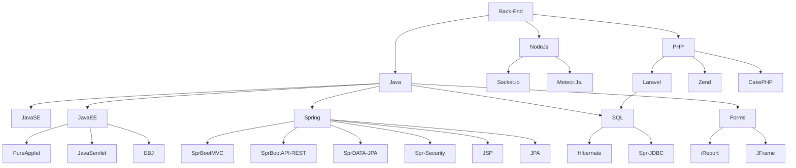

 


 [](https://github.com/ashutosh00710/github-readme-activity-graph)


 <div align="center">  
   
  
  
</div> 


<p align="center">
 


<p align="center">
    <br/><br/><a href="https://www.linkedin.com/in/👽" target="_blank"></a>
    <a href="https://www.instagram.com/👽/" target="_blank"></a>
    <a href="https://twitter.com/👽" target="_blank"></a>
</p>
<p align="center"><a href="https://t.me/👽" target="_blank"></a>
    <a href="mailto:👽@protonmail.com" target="_blank"></a>
<p/>





<p align="center">
 
  

 
   
   
    
   
   
  
  
  
   
   
  
  
  
  
  
   
   
   
   
   
   
   

   
   
   
   
  
<p/>


 ```geojson
{
  "type": "FeatureCollection",
  "features": [
    {
      "type": "Feature",
      "id": 1,
      "properties": {
        "ID": 0
      },
      "geometry": {
        "type": "Polygon",
        "coordinates": [
          [
            [-91.3744, 14.9111], 
            [-91.3667, 14.9333], 
            [-91.3589, 14.9111], 
            [-91.3744, 14.9111], 
            [-91.3744, 14.9111]  
          ]
        ]
      }
    }
  ]
}
```


<div align="center">
<br><p align="centre"><b>Visitors Count 👽 </b></p>  
<p align="center"></p> 
<br>
</div>


